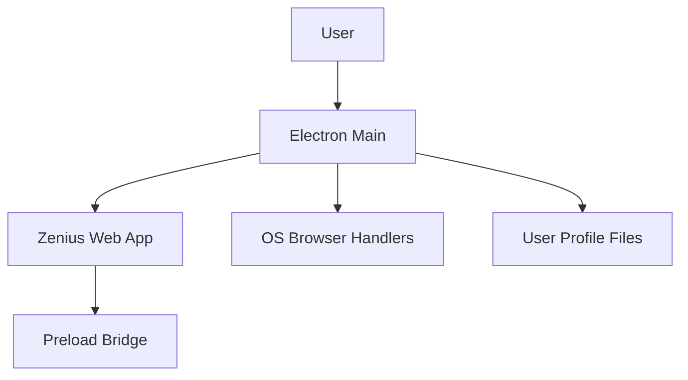

## Executive summary

This repository packages a single-site Electron wrapper around `https://www.zenius.net/`, so the dominant security theme is containment of remote web content rather than server-side data processing. The highest-risk paths are the Electron main process navigation policy in `src/main.js`, the preload exposure in `src/preload.js`, and the boundary where renderer-driven URLs or permissions reach the host OS. The current code now applies sandboxing, context isolation, deny-by-default permissions, and safe external URL handling, but the app still depends on the integrity of trusted Zenius-controlled web origins.

## Scope and assumptions

In scope:
- `src/main.js`
- `src/preload.js`
- `package.json`

Out of scope:
- `node_modules/`
- `dist/`
- `squashfs-root/`
- Remote Zenius server-side infrastructure, which is not present in this repo

Assumptions:
- The app is intended as a desktop wrapper for the public Zenius website and is internet-facing through outbound HTTPS only.
- Authentication, account storage, and learning content are handled by the remote web application, not by code in this repository.
- The desktop app does not need privileged local capabilities beyond opening safe external links and launching a Chromium renderer.
- No additional internal Electron IPC channels exist beyond the preload bridge in `src/preload.js:5`.
- User validation was not available during this pass, so risk rankings that depend on production host inventory or auth flows remain conditional.

Open questions that would materially change risk ranking:
- Which exact production hosts must remain in-app instead of opening in the external browser?
- Does the service rely on third-party identity providers that must complete inside the Electron renderer?
- Are there enterprise deployment requirements that would allow broader permissions such as notifications or media capture?

## System model

### Primary components

- Electron main process in `src/main.js:105` creates the BrowserWindow, loads the remote site, installs URL handling, and applies permission policy.
- Remote renderer content is loaded from `APP_URL` in `src/main.js:9` and `src/main.js:339`.
- The preload layer in `src/preload.js:5` exposes a minimal `zeniusDesktop` flag to the renderer.
- Linux desktop integration in `src/main.js:148` writes a launcher and icon into the user profile when the packaged app runs on Linux.
- Electron Builder configuration in `package.json` packages the app into an AppImage and desktop launcher metadata.

### Data flows and trust boundaries

- User -> Electron renderer
  Data: clicks, typed credentials, navigation events
  Channel: Chromium UI events
  Security guarantees: renderer sandbox and context isolation from `src/main.js:253`
  Validation: top-level navigation is filtered by trusted-origin checks in `src/main.js:269`

- Electron renderer -> Zenius web origins
  Data: HTTPS requests, session cookies, page content, redirects
  Channel: HTTPS via Chromium network stack
  Security guarantees: `webSecurity: true` in `src/main.js:260`
  Validation: only trusted HTTPS Zenius-origin navigations remain in-app via `src/main.js:44`

- Electron renderer -> Host OS external handlers
  Data: approved external URLs
  Channel: `shell.openExternal()` in `src/main.js:210`
  Security guarantees: protocol allowlist in `src/main.js:12` and `src/main.js:58`
  Validation: unsupported protocols are blocked in `src/main.js:205`

- Remote web content -> Electron permission/session boundary
  Data: permission requests such as fullscreen
  Channel: Electron session handlers in `src/main.js:214`
  Security guarantees: deny-by-default request and check handlers
  Validation: only trusted-origin `fullscreen` is allowed in `src/main.js:66`

- Packaged app -> User home directory on Linux
  Data: launcher script, desktop entry, icon file
  Channel: filesystem writes in `src/main.js:156`
  Security guarantees: writes stay under the current user profile
  Validation: no user-controlled file paths are accepted by this code path

#### Diagram

## Assets and security objectives

- User session state
  Why it matters: compromise can expose accounts or learning progress tied to the remote site.

- Renderer integrity
  Why it matters: once hostile JavaScript runs in the Electron renderer, phishing and content spoofing become possible even if Node integration is disabled.

- Host OS interaction boundary
  Why it matters: `shell.openExternal()` and device permissions are the main escape hatches from the browser sandbox to the desktop environment.

- Packaged desktop trust
  Why it matters: users expect the app window, launcher, and navigation behavior to match Zenius and not silently forward them to arbitrary destinations.

- User-local launcher files on Linux
  Why it matters: launcher identity affects how the app is represented and executed on the desktop shell.

## Attacker model

Capabilities:
- A remote attacker can control arbitrary links or redirection targets reachable from trusted Zenius pages.
- A remote attacker can operate an untrusted external website and attempt to lure the user into opening it from inside the app.
- A compromised or forgotten subdomain under an allowed suffix could serve hostile content that still passes the current allowlist.
- A local non-admin user can inspect the packaged app and its user-profile launcher files.

Non-capabilities:
- No evidence in this repo suggests the attacker can invoke Node APIs directly from renderer JavaScript.
- No custom IPC endpoints, native modules, or backend secrets are exposed in this repository.
- No privileged file chooser, arbitrary filesystem import, or local command execution surface is present in the runtime code.

## Threat enumeration

### TM-01: Compromised trusted origin executes hostile content inside the renderer

Impacted assets:
- User session state
- Renderer integrity

Abuse path:
1. An attacker compromises content served from an allowed host under `zenius.net`, `zenius.com`, or `app.zencore.id`.
2. The Electron app keeps that navigation in-app because it matches the trusted-origin policy in `src/main.js:27`.
3. The hostile page runs in the sandboxed renderer and can phish, confuse origin expectations, or abuse any browser-level capability still allowed.

Likelihood: Medium
Justification: The allowlist is narrower than before, but it still trusts domain suffixes rather than a short exact host set.

Impact: High
Justification: A successful compromise reaches real user sessions inside the branded desktop shell.

Overall priority: High

Existing mitigations:
- `contextIsolation: true`, `sandbox: true`, and `nodeIntegration: false` in `src/main.js:255`
- Webview creation blocked in `src/main.js:302`
- Permission policy restricted in `src/main.js:214`

Recommended mitigations:
- Reduce the trusted-host policy to exact production hosts once required flows are confirmed.
- Periodically review the allowlist against real runtime traffic and remove unused subdomains.

### TM-02: Renderer-driven URL opens an unsafe external protocol on the host

Impacted assets:
- Host OS interaction boundary
- Packaged desktop trust

Abuse path:
1. A page or redirect attempts to hand off a custom scheme or local file URL.
2. The app evaluates the URL for external dispatch.
3. If protocol validation is weak, the OS launches an unsafe external handler.

Likelihood: Low
Justification: The new protocol gate only permits `https:`, `mailto:`, and `tel:`.

Impact: High
Justification: Unsafe protocol handoff can cross out of Chromium into desktop handlers or local resources.

Overall priority: Medium

Existing mitigations:
- URL parsing and allowlisting in `src/main.js:19`, `src/main.js:58`, and `src/main.js:204`

Recommended mitigations:
- Keep the protocol allowlist short.
- Log blocked external dispatches in production builds if operational visibility is needed.

### TM-03: Remote content requests browser or device permissions it should not receive

Impacted assets:
- Host OS interaction boundary
- User trust

Abuse path:
1. The remote site or a trusted subdomain requests permissions such as notifications, media, or device access.
2. If Electron defaults or permissive handlers allow the request, the desktop wrapper grants more capability than intended.

Likelihood: Low
Justification: The app now installs explicit permission handlers and only allows trusted-origin `fullscreen`.

Impact: Medium
Justification: Excess permissions expand data collection and user-deception opportunities, even without Node access.

Overall priority: Low

Existing mitigations:
- Deny-by-default session handlers in `src/main.js:214`
- Device permission denial in `src/main.js:236`

Recommended mitigations:
- Review whether `fullscreen` is actually required.
- Add telemetry for denied permission requests if product teams need visibility into broken flows.

### TM-04: Linux launcher integration is tampered with by the local user profile owner

Impacted assets:
- User-local launcher files
- Packaged desktop trust

Abuse path:
1. A local user or malware with the same user privileges modifies the launcher or icon files under `~/.local`.
2. The desktop shell later launches a modified target or displays spoofed metadata.

Likelihood: Medium
Justification: These files are intentionally user-writable and live in the current user profile.

Impact: Low
Justification: This does not cross privilege boundaries; the attacker already runs as the same local user.

Overall priority: Low

Existing mitigations:
- Files are written only under the current user profile in `src/main.js:131`
- No attacker-supplied path input is accepted by the launcher-writing code

Recommended mitigations:
- Treat launcher integrity as a local-user trust issue, not as a remote attack surface.
- Sign and distribute platform-native installers if stronger local integrity guarantees are required.

## Mitigations and recommendations

- Keep the Electron navigation boundary strict. The current controls in `src/main.js:269` and `src/main.js:279` should remain the primary choke point for review.
- Shrink the host allowlist from suffix-based trust to exact hosts as soon as product routing is known.
- Preserve the minimal preload API in `src/preload.js:5` and avoid expanding it without explicit threat review.
- Keep permission policy deny-by-default. If new permissions are needed, add them one at a time with origin checks and tests.
- Continue packaging verification for both source launch and AppImage launch because the runtime writes launcher files on Linux.

## Focus paths for manual security review

- `src/main.js`
  Reason: this is the main trust-boundary enforcement layer for navigation, permissions, popup policy, and OS URL dispatch.

- `src/preload.js`
  Reason: any future expansion of the preload bridge would directly change renderer-to-main trust assumptions.

- `package.json`
  Reason: Electron and builder versions, build targets, and packaging metadata affect the shipped security posture.

- `README.md`
  Reason: operational instructions should match the hardened behavior so users know that external links now leave the app shell.

## Quality check

- All discovered entry points were covered: window creation, remote page load, popup handling, navigation redirects, permission requests, and Linux launcher writes.
- Each trust boundary appears in at least one threat: remote origins, OS external handlers, session permissions, and local profile files.
- Runtime behavior was separated from build outputs and test files.
- User clarifications were not available; assumptions and open questions are explicit above.
- The highest-risk conclusions depend most on the exact production host inventory and any required third-party auth flows.
